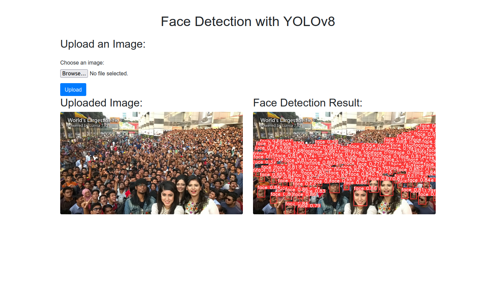
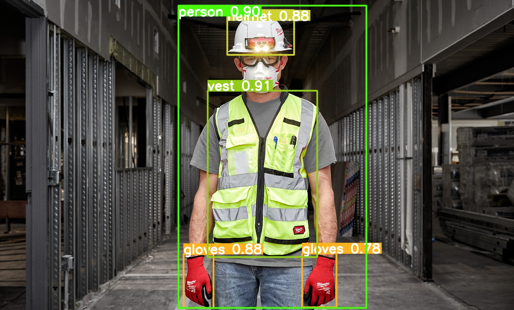

# AI Engineer/ML Engineer
## Technical Skills
- **Programming Languages**: Python, Java, C++
- **Machine Learning Frameworks**: TensorFlow, PyTorch, Scikit-learn, ONNX, OpenVINO, Tensorrt, Keras
- **Computer Vision Frameworks**: OpenCV, YOLO, PaddleOCR, Tesseract, EasyOCR
- **Natural Language Processing Frameworks**: Transformers, NLTK, Spacy
- **API Development**: Flask, FastAPI
- **Deployment**: Docker, Kubernetes, AWS, Streamlit, Heroku

## Experience
**AI Engineer @ Binokular Media Utama (_Feb 2023 - Present_)**
- Quantified improvement in sentiment analysis accuracy by 15% through the development of a machine learning model using the **Transformers**.
- Develop a Digital Out of Home advertising application, enhancing targeted marketing effectiveness by accurately detecting and classifying the gender and age of viewers with
**YOLO** framework.chieved a 20% increase in object detection accuracy for football analysis by implementing a model with the combined utilization of **PyTorch** and **YOLO** frameworks.
- I spearheaded the development of a new microservice aimed at extracting text content from short video like TikTok videos utilizing the **YOLO** framework and **PaddleOCR**. This initiative
resulted in a 15% increase in text extraction accuracy and a 30% reduction in processing time, significantly enhancing the overall efficiency of content analysis workflows.

**Internship Data Scientist @ Central AI Indonesia (_Aug 2022 - Jan 2023_)**
- Successfully created and developed a **Recommendation System** model for related content on the client platform at Bisa AI Academy with Content-Based Filtering.
- Successfully developed a Chatbot system with the **Bot press** framework.
- Developed 2 API systems to integrate the deploy model between client and server.

**Studi Independen Artificial Intelligence Mastery Program (_Feb 2022 - Jun 2022_)**
- Create various artificial intelligence models using **TensorFlow**.
- Perform Computer Vision modelling with **YOLO** framework.
- Develop a Data Science model for the Final Project using the **LSTM (Long short-term Memories)** model.
  
## Education
- B.Ed Vocational Mechatronic Engineering | Yogyakarta State University

## Projects
### Face Detection Apps
The project utilizes YOLOv8, a cutting-edge object detection system, for accurate and real-time face detection in digital images. YOLOv8 is renowned for its speed and precision, making it ideal for various applications like security systems and social media platforms. The model is specifically trained to focus on detecting faces, enabling it to locate and identify faces with high accuracy. Whether it's counting people in a crowd or automatically tagging individuals in social media photos, the face detection system efficiently accomplishes the task with precision.

Link apps: [Face Detection Apps](https://github.com/farizalmustaqim/ml-zoomcamp/tree/main/Face_Detection_using_YOLOv8)

### Personal Protective Equipment (PPE) Detection
The project aims to enhance workplace safety by detecting the presence of Personal Protective Equipment (PPE) in real-time. The model utilizes YOLOv8, a state-of-the-art object detection system, to identify and classify various PPE items such as helmets, vests, and gloves. By integrating the PPE detection system into existing security and surveillance systems, organizations can ensure that employees adhere to safety protocols and regulations. The model's high accuracy and real-time detection capabilities make it an invaluable tool for maintaining workplace safety and preventing accidents.

Link apps: [PPE Detection](https://github.com/farizalmustaqim/Personal-Protective-Equipment-Detection)

## Certificates
- Machine Learning Zoomcamp
- Artificial Intelligence Mastery Program
- AWS re/Start batch 7
- Data Science Bootcamp
